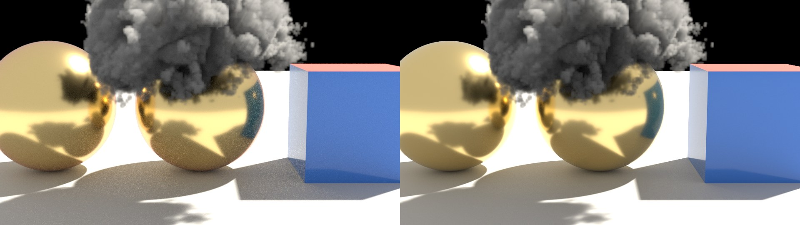

# MoonLightIPR

This is the development branch of [MoonRay for Modo](https://github.com/Pbaroque20/MoonRayForModo/tree/codex/native-avx-modo), where the next version's preview features are built and tried. For the plugin itself, its download and its installation, see the [main page](https://github.com/Pbaroque20/MoonRayForModo/tree/codex/native-avx-modo).

**MoonLightIPR** (echoing DreamWorks' earlier rasterizer MoonLight) is the plugin's fast GPU preview. It shows an approximation of what MoonRay will render and follows your edits as you make them. Final renders always come from MoonRay.

The current release is 0.3.50.2. What is below is coming in 0.3.51 and is not in a release yet.

## Unreleased preview features for 0.3.51

**In the MoonLightIPR preview**

- **Hair** shaded as hair, with MoonRay's hair material.
- **Skin** with MoonRay's skin material, including light glowing through thin parts.
- **Curves** drawn as real strands, as ribbons or round tubes.
- **Fog** inside a MoonRay box or sphere, and **VDB clouds and smoke** from a file.
- **Textures on every kind of light**, not only rect lights.

*Hair in MoonRay (left) and in the MoonLightIPR preview (right).*

*A cloud from a VDB file, MoonRay (left) and MoonLightIPR (right).*

**Closer to Modo**

- **Blinn and Ashikhmin materials** now match Modo's highlights.
- **The sun's disc** in a physical sky has Modo's colour and follows Disc In-Scatter.

**Working faster**

- **Assign a MoonRay material to selected polygons**, with a name, type, colour and smoothing angle.
- **Graph editor**: big graphs open on the output node and zoom freely.
- **Ramps** open in the ramp editor straight from a material's properties.
- **Light Path Expressions** has its own entry in the MoonRay menu and under Advanced in the render settings.
- **Dragging the sun or an environment light** updates the preview when you let go.

## Known issues

**MoonLightIPR preview**

- Very smooth highlights (roughness under about 0.2) are dimmer than Modo's.
- Fog and clouds scatter light once, so thick clouds look darker inside than in MoonRay. A VDB's own glow (its emission grid) is not drawn.
- Two VDB volumes that overlap shadow each other wrongly.
- Hair is close to MoonRay's but not exact; see-through strands cast shadows that are too dark or too light.
- Skin and wax look for light beneath the surface straight down only, so thin edges can look flat.
- Textured sphere and spot lights are noisier than textured rect and distant lights.
- Rod, barn door, cookie and VDB light filters are not drawn.
- Motion blur is not shown while the preview follows your edits.

**Hair**

- Growing dense hair for the first time, or after moving a guide, takes several seconds (about 8 for 30,000 strands). Re-rendering after that is quick.
- Hair grows from curves you draw as guides; Modo's Fur material is not read.

**Materials and Modo parity**

- Under Principled, Modo's diffuse gets brighter with roughness and MoonRay's does not.
- A roughness driven by an image is not adjusted for Blinn and Ashikhmin materials.

**Everything here**

- Tested on one machine (RTX 3090), and measured against MoonRay rather than used on production scenes.
- The light path expression check catches typing mistakes only; an expression can pass and still match no light.

The [main page](https://github.com/Pbaroque20/MoonRayForModo/tree/codex/native-avx-modo#limitations) lists the plugin's wider limitations.

## Still to implement

- One-click outputs for indirect diffuse and specular, shadows, albedo, subsurface and motion vectors.
- Rod, barn door, cookie and VDB light filters in MoonLightIPR, and motion blur while it follows edits.
- Modo's Fur material, light linking, and the remaining Shader Tree effects and masks.
- OpenPBR and glTF MaterialX surfaces.
- Per-face and per-point values on meshes, with a form to edit them.
- Motion, creases and authored normals from imported RDL scenes, and progress while a large one opens.

**From MoonRay's reference documentation** (things MoonRay does that the plugin has no control for yet)

- **Deep images**: deep EXR output and its settings.
- **Light sets, shadow sets, shadow receiver sets and trace sets**: which lights light, and which objects shadow, what.
- **Display filters**: MoonRay's post-render filters (blend, colour correct, convolution, depth of field, halftone, ramp, toon and the rest). Only the image filter is in the Windows build.
- **Render settings not in the form**: volume quality and depth, presence and hair depth, sample and roughness clamping, pixel filter, texture blur and texture cache size, Russian roulette, frame-locked noise.
- **Texture baking** with the bake camera as a workflow, not only as an item.
- **Arras**: rendering one frame across several machines.
- **Alembic and USD geometry procedurals**, which the Windows build does not include.

## More

- [How MoonLightIPR works, what it draws and how closely it matches MoonRay](moonlightipr/README.md)
- [The plugin's main page](https://github.com/Pbaroque20/MoonRayForModo/tree/codex/native-avx-modo), with the full feature list, limitations and installation
- [What was new in 0.3.50](docs/WHATS_NEW_0350.md)

Developed by Raphael Tobar with AI assistance. MoonLightIPR is under the [MIT License](moonlightipr/LICENSE) and is not affiliated with DreamWorks Animation; see [moonlightipr/NOTICE.md](moonlightipr/NOTICE.md). Plugin licensing is in [LICENSE](LICENSE).
