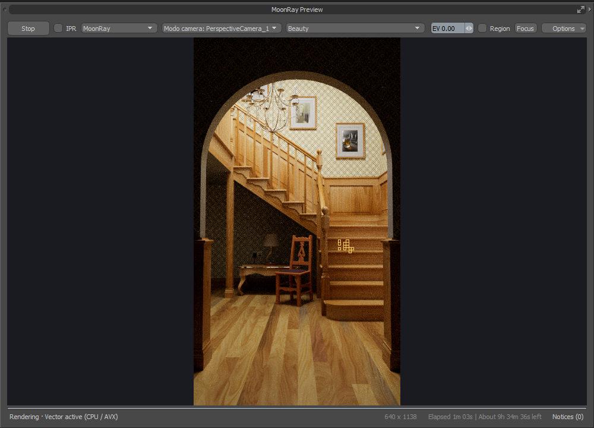
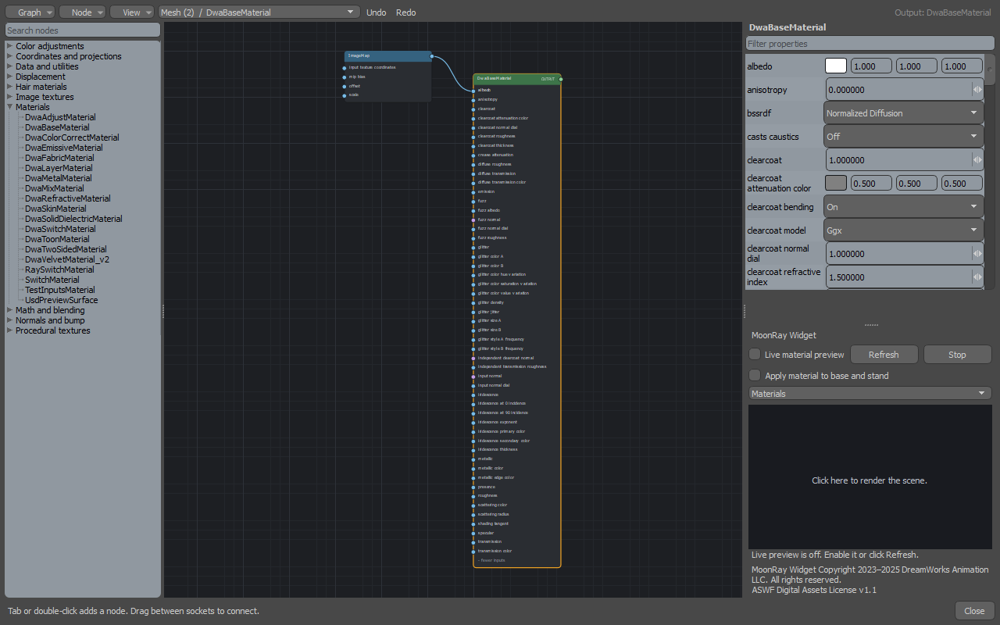
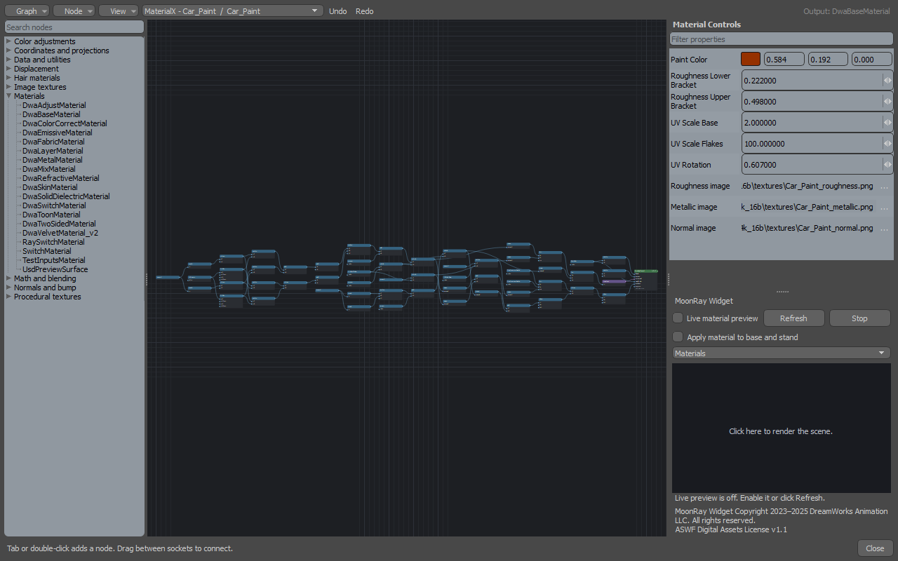
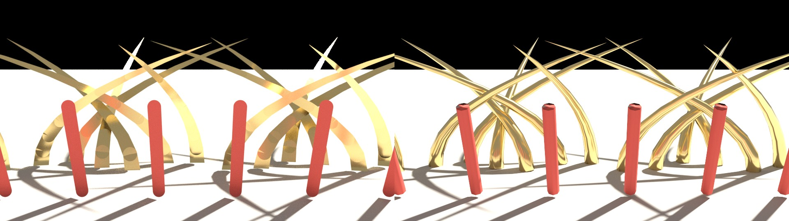
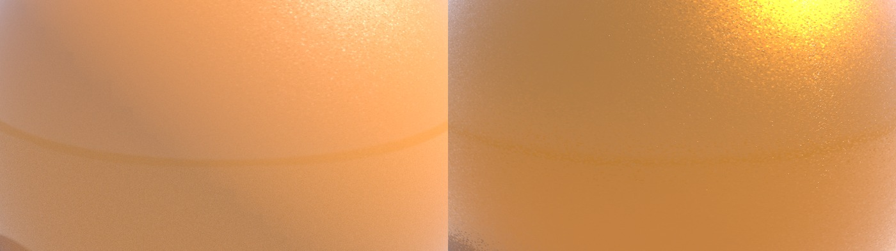
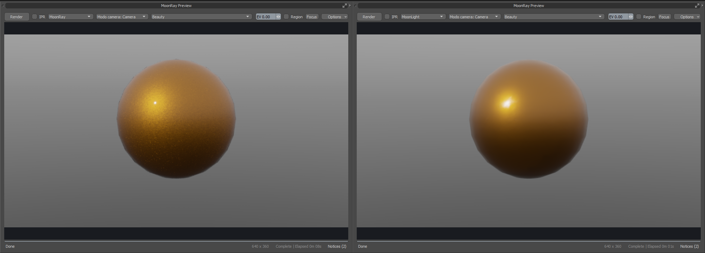
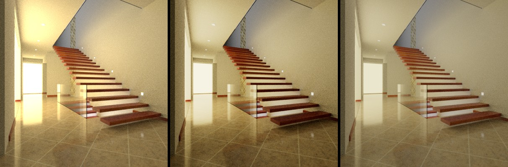

# Dreamworks' MoonRay for Modo

Stanford Dragon 3D Model (created by Brian Curless & Marc Levoy)
 

MoonRay for Modo integrates DreamWorks’ open-source MoonRay renderer with **Modo 16.1v9 on Windows**, running natively without WSL. Developed by Raphael Tobar w/ AI-Assistance.

The plugin includes CPU and XPU rendering, a dockable live preview with a second GPU preview engine, native MoonRay materials with a graph editor, Shader Tree translation, MoonRay's own lights and other items, MaterialX and RDL scene import, AOVs, and denoising.

**Current version: 0.3.50.2 — experimental development build.** It is 0.3.50.1 with one fix: a glass material with an absorption depth on one part of a mesh of several parts no longer stops MoonRay as the render begins.

[Download the packaged 0.3.50.2 kit and Windows runtime](https://github.com/Pbaroque20/MoonRayForModo/releases/tag/v0.3.50.2) · [Installation instructions](docs/INSTALLATION.md) · [What's new in 0.3.50](docs/WHATS_NEW_0350.md)

*The preview window in Modo 16.1v9, rendering The Wooden Staircase (by Wig42, CC BY) after it was imported from MoonRay's own scene files.*

## New in 0.3.50

- **MoonLight**, an approximate NVIDIA GPU preview engine, chosen in the preview window. It follows edits as they are made; output renders still use MoonRay. See [moonlight/README.md](moonlight/README.md).
- **MoonRay-specific items, added from the MoonRay menu**: 30 of MoonRay's own lights, light filters, cameras, shapes and volumes as Modo items (dwEnvLight, dwRectLight, dwSpotLight and the rest), each with its own properties form and a viewport proxy, for what Modo has no item for. VDB volumes load from a file.
- **Import MoonRay Scene (RDL)**: a MoonRay scene comes in whole. Meshes keep their transforms and are instanced, curves come in as curves, lights and other MoonRay objects become MoonRay items, materials keep their graphs, and the scene's settings and outputs go to the render settings. A scene in two files (`scene.rdlb` and `scene.rdla`) is read as one. All ten of MoonRay's published example scenes re-render as the same picture after a trip through Modo.
- **MaterialX import**: a `.mtlx` material becomes a material of its own kind in the Shader Tree, with controls for the values and images its file names.
- **Curves and hair**: a mesh's curves render as tubes or ribbons, with width, taper and UVs along the length; hair can be grown from guide curves, held to a scalp mesh.
- **Modo parity for lights, daylight and standard materials**: Modo's lights, physically based daylight (with its sun disc) and the standard material's specular, roughness and Fresnel are translated by measurement against Modo's own renderer.
- **A leaner preview window**: one toolbar with a single Render/Stop button, IPR, engine, buffer, exposure, region and a focus picker; render settings on the Render item; one-click Cryptomatte; a working time estimate.
- **MoonRay materials on objects, in place of material overrides**: select a mesh and assign a MoonRay material to it, or add one from the Shader Tree's Add Layer list. Each is a material of its own kind with its own properties form. The separate MoonShine and MaterialX override layers of earlier versions are no longer offered; scenes that hold them still load and render.
- **A redesigned graph editor**: its own window that does not block Modo, a gridded canvas, compact nodes, an add-node search, and a proper control for every property, including ramps and a UV map chooser.
- **Editing that goes both ways, live**: a material can be edited in the graph editor, in its properties form or in the Shader Tree; a change in one shows in the others, and with IPR on the preview follows each change as it is made, without a re-read of the scene. MoonLight follows lights, transforms and materials even while they are being dragged.
- **ACES by default**: the preview's view transform starts as ACES for an sRGB monitor, with no configuration file to find. Plain sRGB and others remain as choices.
- **Heavy scenes**: meshes of 5,000 polygons or more are read from Modo in one call by the native adapter, and written out for MoonRay several times faster. GPU renders with many outputs have four times the room they had, and fall back to the CPU rather than stop if that still runs out.

### The graph editor

*A MoonRay material in the graph editor: nodes to add on the left, the graph in the middle, and a control for every property of the selected node on the right. Edits here, in the material's form and in the Shader Tree show in each other, and IPR follows them.*

*An imported MaterialX car paint. With no node selected the panel shows the material's own controls: the colours, numbers and images its file names.*

### Curves as tubes

*A mesh's curves, splines and line polygons rendered with a width at the root and at the tip: MoonRay on the left, MoonLight on the right. The gold strands taper to a point; the red ones keep their width.*

### Imported MoonRay scenes, before and after

In each pair, MoonRay's render of the scene from its own files is on the left; on the right is the same scene after it was imported into Modo and rendered through the plugin. Small, low-sample test renders; [docs/images](docs/images/README.md) has the scenes' authors and licenses.

| | |
|---|---|
|  |  |
| Bedroom (SlykDrako, CC0) | Country Kitchen (Jay-Artist, CC BY) |
|  |  |
| Modern Hall (NewSee2l035, CC BY) | Contemporary Bathroom (Mareck, CC0) |

### Imported MaterialX materials

*TH Wood Table from [AMD's GPUOpen MaterialX Library](https://matlib.gpuopen.com/main/materials/all), imported from its `.mtlx` file: MoonRay on the left, MoonLight on the right.*

*The flakes of the library's Car Paint, close up: MoonRay on the left, MoonLight on the right. The flakes are in the reflection, driven by the file's own flake textures.*

*The same material at a normal viewing distance in the preview window, with MoonRay and then MoonLight chosen. MoonLight's denoiser softens the flakes at this distance until the picture has gathered more samples.*

### View transforms

*One linear render shown three ways: plain sRGB, ACES (the default), and highlight compression + sRGB. Modern Hall by NewSee2l035, CC BY.*

### MoonLight beside MoonRay

*MoonRay on the left, MoonLight on the right: a rect, a disk and a sphere light. [moonlight/README.md](moonlight/README.md) has more pairs and the measured differences.*

## Currently implemented

- Native Windows rendering: CPU/AVX and NVIDIA XPU, with XPU → Vector → Scalar fallback.
- Interactive preview: dockable window, IPR, progressive updates, persistent renderer sessions, worker-tile/bucket overlays, and the MoonLight GPU engine.
- Materials: native MoonRay materials with their own forms, a visual node editor, material preview, and MaterialX import.
- Modo scene translation: standard and Principled materials, image textures, normal/bump maps, procedurals, lights, daylight, environments, subdivisions, instances, replicators, curves and hair—with the limits below.
- MoonRay items: lights, light filters, cameras, analytic shapes and volumes with their own properties.
- Render outputs: configurable AOVs, Cryptomatte surface categories, buffer switching, and cached beauty denoising (OptiX or Open Image Denoise).
- Workflow tools: ACES/sRGB/OCIO view transforms and LUTs, animation output and recovery controls, an asset library, and RDL scene import.

## Limitations

- **Windows and Modo 16.1v9 only.** XPU and MoonLight need an NVIDIA GPU; they have been exercised on an RTX 3090 only.
- **MoonLight is an approximation.** It matches MoonRay closely on many scenes but not all; it has no volumes, no hair shading model, no subsurface scattering, and shows curves as tubes of polygons. Some light filters and textures on lights other than rect lights are left out; it lists what it leaves out in the preview's notices.
- **Modo parity is partial.** Only Modo's own lights and standard/Principled materials are matched. Blinn and Ashikhmin highlights are not calibrated, anisotropy is untested, rough environment reflections come out dimmer in MoonRay, and remaining Shader Tree effects, some masks and light linking are not translated.
- **MaterialX is a supported subset**: Standard Surface graphs made of images, arithmetic and UV transforms. OpenPBR and glTF surfaces, and nodes outside that subset, are not read.
- **RDL import leaves some things out**, and names each in its report: motion (the scene comes in as it stands at shutter open), values that differ face by face or point by point, subdivision creases, authored normals, light linking and shadow sets, instancing from point files, and classes the plugin has no item for. Per-item values an imported scene brings render correctly but have no form in Modo yet. Opening a large scene's files takes minutes before the import proper begins.
- **Geometry**: some instancing, motion, subdivision, UV-projection and normal-map cases differ from Modo. A mesh that mixes polygon kinds or needs per-polygon projection is read the slower way.
- **Cryptomatte**: volume coverage is unfinished; ID previews are not an interactive matte-selection tool.
- **Preview**: some edits still need the whole scene read again; with a denoiser on, the denoised view is off while IPR follows the scene.

## Still to implement

- A hair shading model and skin (subsurface) in MoonLight, and volumes there.
- One-click outputs for indirect diffuse and specular, shadows, albedo, subsurface and motion vectors.
- OpenPBR and glTF MaterialX surfaces.
- Per-face and per-point values (primitive attributes) on meshes, and a form for editing the values items carry.
- Motion from imported RDL scenes as Modo animation; subdivision creases and authored normals on import.
- Progress while a large RDL scene's files are being opened.
- Light linking, and the remaining Shader Tree effects and masks.
- Broader validation: other GPUs and drivers, clean-machine installs, very large scenes, recovery under load, and colour matching.

**Production readiness:** this is an experimental development build, not a production-certified release. It has been exercised on one machine. Each release note says what was and was not checked.

Detailed implementation notes and recorded checks are in [docs](docs/). Plugin licensing is in [LICENSE](LICENSE); MoonRay and bundled assets retain their respective licenses. MoonLight, the GPU preview engine, was created by Raphael Tobar and is under the same MIT License; it is not a DreamWorks Animation product and is not affiliated with or endorsed by DreamWorks Animation (see [moonlight/NOTICE.md](moonlight/NOTICE.md)).
