# Images in the documents

These pictures were made while 0.3.50.1 was being checked, on one machine (RTX 3090), at small sizes and low sample counts: they are there to show what was compared, not to show the renderer at its best. The noise in them is the sample count.

## Imported MoonRay scenes (`rdl-*.jpg`)

Each shows a scene rendered by MoonRay from its own files on the left, and on the right the same scene after **Import MoonRay Scene (RDL)** brought it into Modo and the plugin wrote it back out for MoonRay. Both at 400 pixels wide, 36 samples a pixel. Made by `tools/check_rdl_import.py --compare`.

The scenes are from [MoonRay's published example scenes](https://docs.openmoonray.org/getting-started/test-scenes/), which are the pbrt-v3 versions curated by Benedikt Bitterli ([Rendering Resources](https://benedikt-bitterli.me/resources/)), converted to RDL by DreamWorks:

| Picture | Scene | Author | License |
|---|---|---|---|
| `rdl-bedroom.jpg` | Bedroom | SlykDrako | CC0 |
| `rdl-contemporary_bathroom.jpg` | Contemporary Bathroom | Mareck | CC0 |
| `rdl-glass-of-water.jpg` | Glass of Water | aXel | CC0 |
| `rdl-veach-bidir.jpg` | Veach, Bidir Room | Benedikt Bitterli | CC0 |
| `rdl-veach-mis.jpg` | Veach, MIS | Benedikt Bitterli | CC0 |
| `rdl-coffee_maker.jpg` | Coffee Maker | cekuhnen | CC BY |
| `rdl-country_kitchen.jpg` | Country Kitchen | Jay-Artist | CC BY |
| `rdl-modern_hall.jpg` | Modern Hall | NewSee2l035 | CC BY |
| `rdl-salle_de_bain.jpg` | Salle de bain | nacimus | CC BY |
| `rdl-the_wooden_staircase.jpg` | The Wooden Staircase | Wig42 | CC BY |

`rdl-test-curves.jpg` and `rdl-test-multi-level-instances.jpg` are two of the test scenes in MoonRay's own source (`testdata`), which is under the Apache License 2.0.

## Others

- `preview-window.png`: the MoonRay Preview window in Modo 16.1v9, rendering The Wooden Staircase (Wig42, CC BY) after import. The yellow squares are the tiles being worked on.
- `view-transforms.jpg`: one linear render of Modern Hall (NewSee2l035, CC BY) shown three ways: plain sRGB, ACES (sRGB display), and highlight compression + sRGB.
- `moonlight-*.jpg`: the same scene in MoonRay on the left and MoonLight on the right, from `tools/compare_moonlight.py`. The scenes are built by that script.

## MaterialX materials (`moonlight-materialx-*.jpg`)

Five materials from [AMD's GPUOpen MaterialX Library](https://matlib.gpuopen.com/main/materials/all), imported with **Import MaterialX Material** and put on a ball: MoonRay on the left, MoonLight on the right. Car Paint, TH Wood Table, Pale Pink Carrara Marble, Indigo Palm Wallpaper and Fresco Decor Wallpaper. The library publishes its materials under the MIT License or as public domain; four of the five files carry the MIT terms in the file itself. Made by `tools/render_materialx.py`.

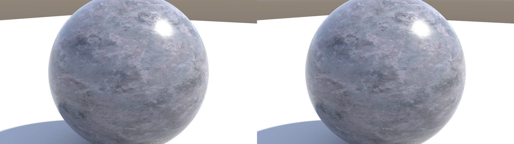
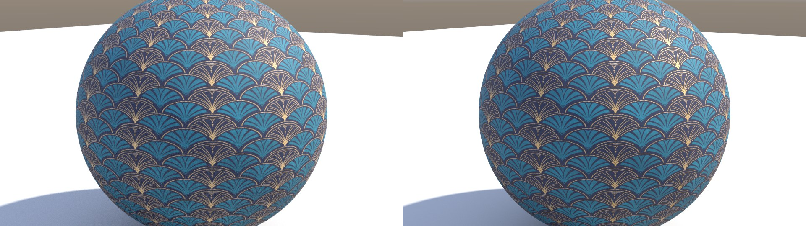
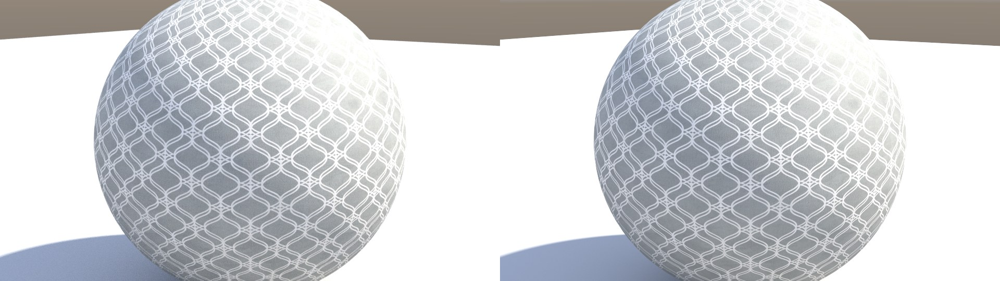

## All ten example scenes

Left of each pair: MoonRay's render from the scene's own files. Right: after import into Modo.

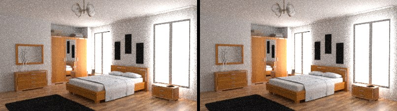
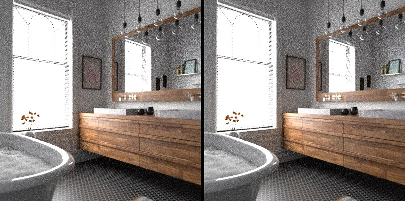
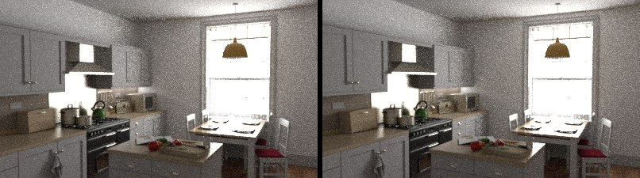
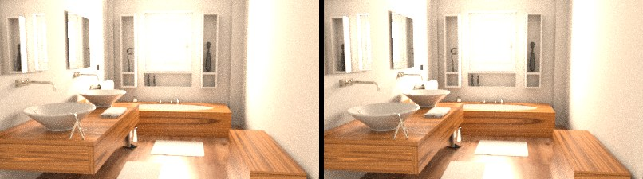
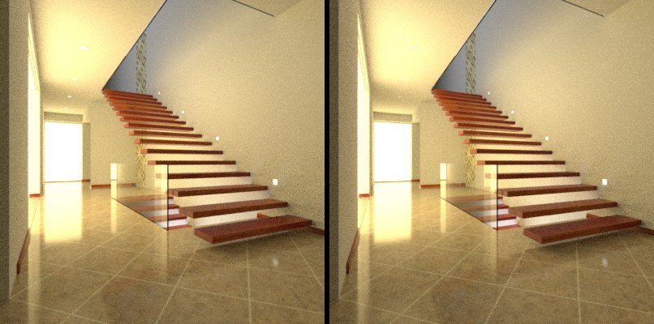
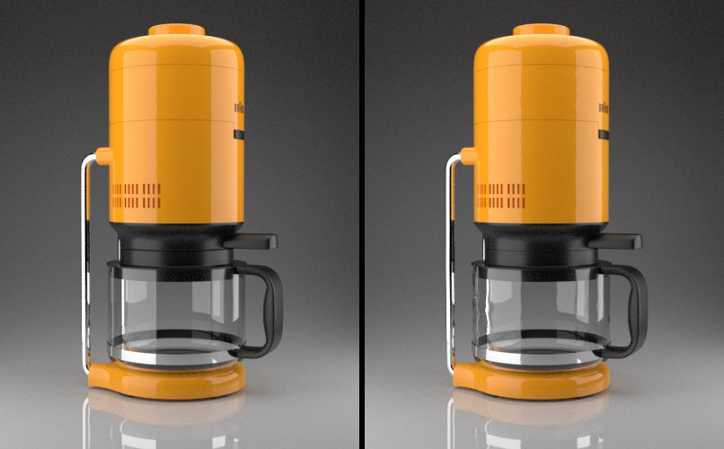

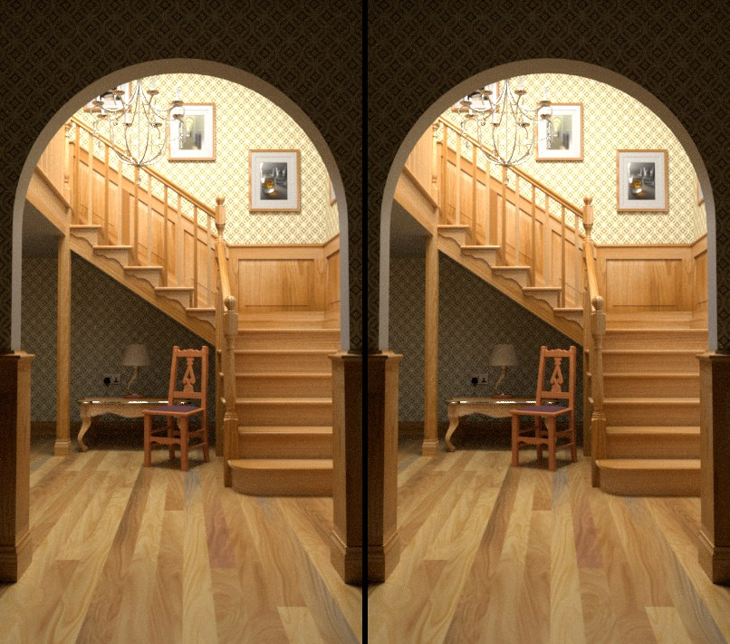
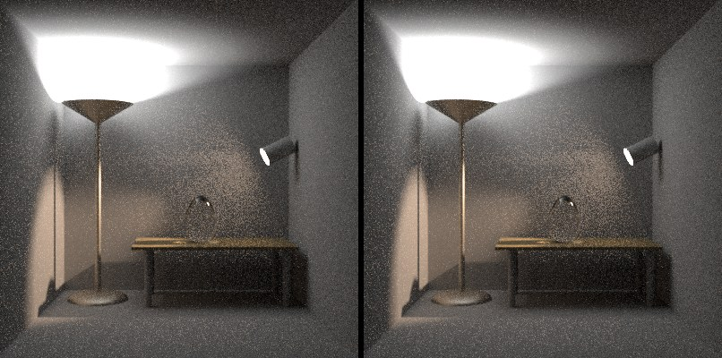
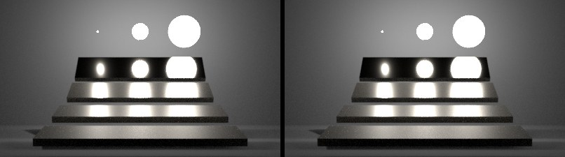

## MoonLight: subdivision

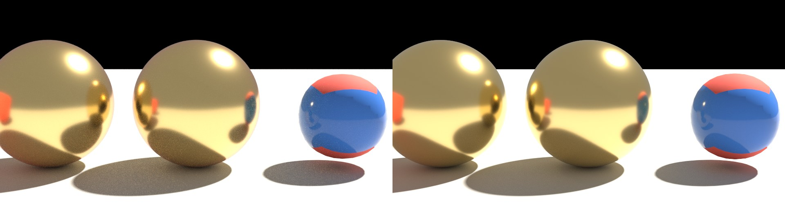
