# MoonLightIPR (experimental)

*Updated October 9, 2026, for MoonRay for Modo 0.3.50.1. Sections that record a check keep the date it was made.*

Created by Raphael Tobar. Released under the [MIT License](LICENSE). MoonLightIPR is not a DreamWorks
Animation product and is not affiliated with, sponsored by or endorsed by DreamWorks Animation;
it is a separate renderer that previews what MoonRay will render. See [NOTICE.md](NOTICE.md).

MoonLightIPR is the name of the preview engine everywhere: in the plugin, in these documents, and
in the source, where files, folders, the C++ namespace and the session executable are
`moonlightipr`. The name echoes MoonLight, the rasterization renderer DreamWorks used before
MoonRay; the two are otherwise unrelated. Releases 0.3.50.1 and 0.3.50.2 showed it as
"MoonLight" and shipped it in a `moonlight` folder; the full name is used from then on so that
the one is not taken for the other.

MoonLightIPR is a small standalone OptiX path tracer intended as an interactive preview
engine beside MoonRay. It does not touch MoonRay's renderer. It is an approximation:
one fixed uber-shader replaces MoonRay's materials, and final frames always come from
MoonRay. It ships in the 0.3.50.1 release, in the runtime's `moonlightipr` folder, and is
chosen in the preview window's engine popup. `tools/install_moonlightipr.py` adds a newer
build to an installed kit during development.

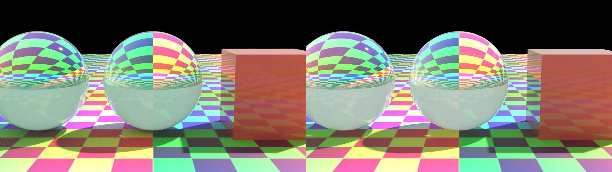
*MoonRay on the left, MoonLightIPR on the right. Every pair on this page is laid out that way and comes from `tools/compare_moonlightipr.py`.*

## Where it stands

- It is used inside Modo: Render and IPR both go through it, and with IPR on it follows
  light, transform and material edits, including while they are dragged.
- It draws Modo's standard and Principled materials, MoonRay's Dwa surface materials,
  material stacks from the Shader Tree, imported MaterialX graphs, MoonRay's own light
  items, curves and hair, subdivision surfaces, depth of field and motion blur.
- It shades hair as MoonRay's hair material does, reads MoonRay's skin material, draws curves as
  curves and draws an even fog in a MoonRay box or sphere shape. VDB volumes it does not draw.
- It produces beauty only: other buffers and Cryptomatte need MoonRay.
- Agreement with MoonRay is measured, scene by scene, further down. It is close on
  lights and plain materials and looser on layered materials and glass.
- It has been run on one GPU, an RTX 3090.

## What exists

- `include/moonlightipr/moonlightipr.h`: the host API. Triangle meshes, instances, a
  material table, a latitude-longitude environment and a pinhole camera go in;
  accumulated and denoised linear RGB come out.
- `src/renderer.cpp`: CUDA buffers, one acceleration structure per mesh under a single
  instance layer, the OptiX pipeline, and the OptiX denoiser guided by albedo and normal.
- `src/device/kernel.cu`: a progressive megakernel, one sample per pixel per launch.
  Lambert diffuse under a GGX specular lobe, using the UsdPreviewSurface metallic
  workflow (`baseColor`, `metallic`, `roughness`, `ior`, `emission`). The environment
  is importance sampled and combined with BSDF sampling. Depth defaults to 4 bounces
  with Russian roulette. Since then: a weight on the specular lobe and a conductor's
  Fresnel, so that Modo's and MoonRay's materials keep their own balance; refraction,
  clearcoat, subsurface, anisotropy, absorption and dispersion; and a distant light whose
  disc the camera can see, for the sun of a physical sky.
- The denoiser is given the light without the surface colour: the picture is divided by
  the albedo, denoised and multiplied back, so that a printed pattern is not smoothed away,
  and from 32 samples on a growing share of the picture's own detail is kept beside the
  denoised one (half at 256 samples, four fifths from 1024). `tools/check_moonlightipr_denoise.py`
  measures what it keeps. The divide and multiply run on the CPU; their cost at 4K has not
  been measured.
- `probe/moonlightipr_probe.cpp`: renders a built-in scene, times samples and the
  material, transform and camera edit paths, and writes images.
- `session/`: `moonlightipr_session.exe`, a long-lived process. It reads packed scenes
  named on standard input and publishes frames through the same `@@MODO_SHARED`
  shared-memory mailbox and `@@MODO_SESSION` events as the persistent MoonRay session.
- `kit/.../moonray_modo/moonlightipr_scene.py`: packs the plugin's scene snapshot, the
  same dictionary `rdla.py` serializes, into that binary scene. It imports nothing
  from Modo.
- `kit/.../moonray_modo/moonlightipr_session.py`: the Qt class that owns the process,
  with the signals of `persistent.Session`.
- `render.py` and `panel.py`: an engine popup in the preview window's toolbar, saved as
  a user preference. With MoonLightIPR selected, preview requests go to the session and
  its frames reach the preview through the normal buffer and display path, at full
  preview size (the IPR size and sample limits apply to MoonRay only). Its warnings
  are added to the window's Notices. Output renders always use MoonRay. The preview
  material choices in the Options menu are honoured.

## Matching MoonRay

The shading and path rules are taken from MoonRay's sources rather than tuned by eye:

- The lobes follow `UsdPreviewSurface`: a GGX lobe with exact dielectric Fresnel, a
  conductor of the base colour weighted by `metallic`, and Lambert diffuse beneath,
  attenuated the way `OneMinusRoughFresnel` does it (on the view direction, blending
  to normal incidence with roughness).
- Diffuse and glossy bounces are counted separately against `max_diffuse_depth` and
  `max_glossy_depth`, within `max_depth`.
- With more than four sphere, rect, disk and spot lights, each bounce samples one of
  them, chosen in proportion to its power, instead of all of them.
- Any single light sample brighter than 10 after the first bounce is scaled down, as
  MoonRay's default `sample_clamping_value` does. This is what removes sparkling
  caustics.

`tools/compare_moonlightipr.py <moonray-runtime>` renders seven scenes in both
renderers, each isolating one kind of light over plain materials, and reports the
brightness ratio overall and per 20-pixel tile. MoonRay's images are kept while a
scene's text is unchanged, since each takes a minute or more on the CPU. Results on
October 6, 2026 against `xpu-paths-0349-candidate` (MoonLightIPR 2048 samples, MoonRay
36):

| Scene | MoonLightIPR / MoonRay | Tiles within 10% |
|---|---|---|
| Sun | 1.007 | 93% |
| Uniform sky | 1.011 | 96% |
| Gradient sky | 1.001 | 86% |
| Sphere light | 1.012 | 96% |
| Rect light | 1.009 | 95% |
| Disk light | 1.006 | 95% |
| Spot light | 1.005 | 91% |

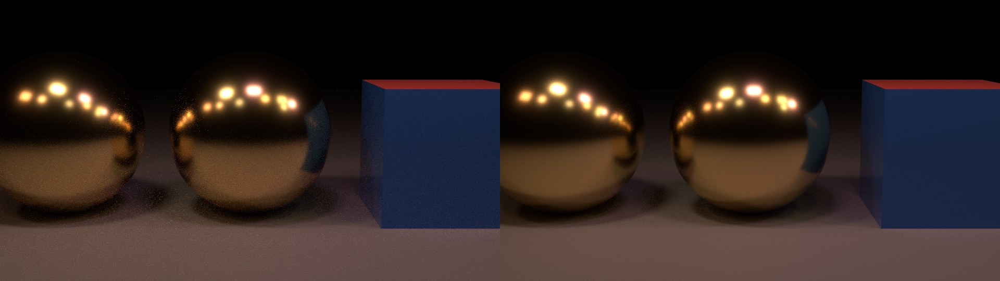
*Nine sphere and rect lights of different power.*

Three more scenes cover textures and the two ways a material reaches MoonRay:

| Scene | MoonLightIPR / MoonRay | Tiles within 10% |
|---|---|---|
| An environment image, turned 40 degrees | 0.983 | 100% |
| Textures on plain materials (`UsdPreviewSurface`): colour, roughness and normal maps | 1.000 | 98% |
| Material stacks without textures (`DwaBaseMaterial`) | 0.973 | 64% |
| Material stacks with layers (`DwaBaseMaterial`): multiply blend, a half-opaque material row | 0.982 | 61% |
| A glass ball and a clearcoated cube under a sun and sky | 1.090 | 69% |
| A thin tinted ball and a half-present cube | 1.076 | 78% |
| Nine sphere and rect lights of different power | 0.998 | 98% |
| A masked material row, a half-opaque group and a bump map | 0.968 | 54% |

A third set, added October 7, 2026, covers what was translated last (MoonLightIPR 2048
samples, MoonRay 36):

| Scene | MoonLightIPR / MoonRay | Tiles within 10% |
|---|---|---|
| Cylinder light | 1.005 | 95% |
| Portal light in front of a uniform environment | 1.004 | 97% |
| Mesh light (a lit panel) | 1.014 | 85% |
| Depth of field, disc lens | 1.010 | 96% |
| Depth of field, five-blade lens | 1.010 | 97% |
| Layered environment (a gradient with a colour multiplied over it) | 1.006 | 97% |
| Physical sky | 1.006 | 93% |
| Subsurface scattering, full on a ball and half on a cube | 0.965 | 94% |
| Anisotropy, along and across texture u | 0.987 | 95% |
| Absorption inside glass | 1.006 | 89% |
| Dispersion (Abbe number 4) | 1.056 | 83% |
| Checker, noise, a gradient and layer curves | 0.971 | 56% |

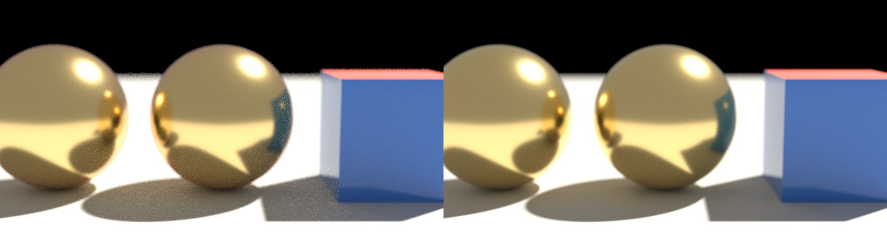
*Depth of field through a disc lens.*

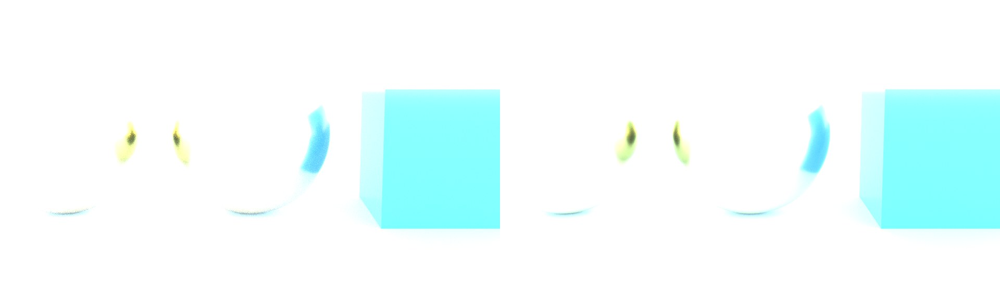
*A physical sky.*

In the last scene the checker, the noise and the gradient agree by eye; the stripes where
the curves push roughness to about 0.9 are paler in MoonRay. Roughness above 0.6 on
material stacks has not been compared in isolation. Motion blur has no comparison yet:
it was checked only for running and for returning to the still image afterwards.

Four things MoonRay itself got wrong came to light here, in the plugin's translation
rather than in MoonLightIPR. Three are fixed on this branch:

- Mesh lights lit nothing. MoonRay refuses a `MeshLight` whose geometry is also in the
  render layer; `rdla.py` now gives the light its own copy of the geometry.
- Gradient layers rendered blank. MoonRay's `RampMap` holds at most 20 points and the
  plugin sent 257; `gradients.py` now resamples to 20, and MoonLightIPR shows the same 20.
- Dispersion was never switched on. `DwaBaseMaterial` ignores the Abbe number unless
  `use_dispersion` is set; `moonshine.py` now sets it.
- UDIM tiles did not load in the comparison: MoonRay reported every tile missing although
  the files were there, and drew its error colour. This looks like the Windows port's
  tile search and was not pursued, so UDIM in MoonLightIPR is unverified against MoonRay.

Texture orientation, sRGB decoding, blending and normal mapping agree with MoonRay to
about 1% region by region on the plain-material path.

Material stacks are what the Shader Tree produces, and they render through
`DwaBaseMaterial`, which differs from `UsdPreviewSurface` in two ways MoonLightIPR now
follows. It dims diffuse under the specular lobe by the full Fresnel term rather than
softening it with roughness. And its specular lobe is Beckmann, not GGX: a stack binds
every channel, anisotropy included, and the plugin selects the Beckmann model whenever
anisotropy is bound. Both shaders also add back the light lost between facets
(Kelemen 2001, as in Kulla and Conty 2017) once roughness passes one half;
MoonLightIPR computes the same albedo tables at start-up, and they agree with MoonRay's
to a few percent.

Since October 7 the plugin chooses GGX for Modo's standard materials unless anisotropy is
set, and MoonLightIPR follows whichever the material uses.

A bare ground plane under the sun isolates these. Through `DwaBaseMaterial` it now
matches MoonRay to three decimal places at roughness 0.3 and 0.6, a black plastic
matches to four, a blue metal at roughness 0.35 shows no sun glint in either, and a
grey metal at roughness 0.6 is within 1 to 4%. Through `UsdPreviewSurface` the plastic
matches to four decimal places and the metals to 1 to 3%. Before these three rules
the stack scene without textures was 17% too bright, and the layered one had 35% of
its tiles within 10% where it now has 61%.

What is left in the full scenes is mostly near shadow edges and in glass, where the
two renderers resolve noise and clamped bounce light differently, and has not been
broken down further.

Before these rules were matched the sun scene was 9% too bright, with shadows near
the metal balls twice as bright. The test scenes use only plain and metallic
materials on simple shapes; they say nothing about textures, layered materials or
anything else the packer reports as approximated.

Later comparisons, October 8 and 9, 2026:

| Scene | MoonLightIPR / MoonRay | Picture within 10% |
|---|---|---|
| Rect, disk and sphere lights whose brightness is not spread over their size (`normalized` off) | 1.010 | 97% |
| MoonRay's own items: a tinted environment, a sphere light, a box and a ball | 1.014 | 96% |
| Portal light, run again | 1.004 | 97% |
| Five MaterialX materials from a library (a wood, a marble, two wallpapers, a car paint), on a ball | not recorded | 92 to 100% on four, 72% on the car paint |

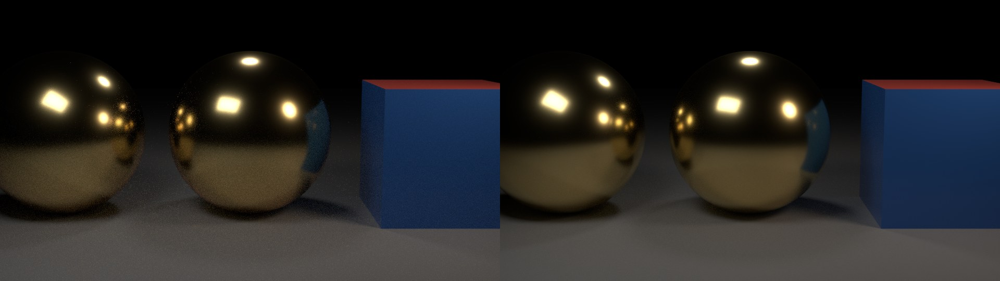
*A rect, a disk and a sphere light with `normalized` off, after the fix described next.*

Lights with `normalized` off were drawn far too dim until October 9: MoonLightIPR treated every
light as normalized. It now gives such a light the brightness that comes to the same
thing (the intensity times pi times its area), which is what brought a hallway lit by large
windows level with MoonRay. A distant light set that way is not worked out and gets a notice.

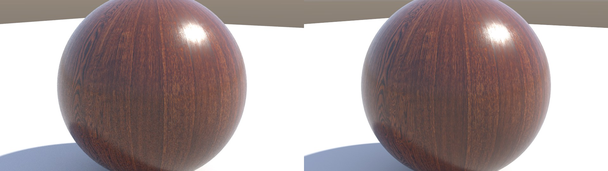

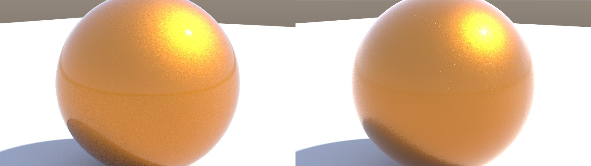
*TH Wood Table, Indigo Palm Wallpaper and Car Paint from [AMD's GPUOpen MaterialX Library](https://matlib.gpuopen.com/main/materials/all) (MIT License or public domain), MoonRay left, MoonLightIPR right.*

The car paint's flakes are in its reflection, not its colour, so the denoiser softens them
at low sample counts; they sharpen as the picture gathers samples.

## Using it in Modo

With the release installed there is nothing to set up: choose **MoonLightIPR** in the preview
window's engine popup and press Render. The rest of this section is for development builds.

`python tools/install_moonlightipr.py` adds a built MoonLightIPR to the installed kit: the
session into the kit's `runtime/moonlightipr`, plus the Python modules that route
previews to it and the four MoonRay translation modules fixed alongside (`rdla.py`,
`lighting.py`, `moonshine.py`, `gradients.py`). It backs up what it replaces under `backups/`, leaves the rest of
the kit alone, and refuses to run while Modo is open.

The plugin looks for MoonLightIPR in a `moonlightipr` folder inside the selected MoonRay
runtime, and falls back to the copy in the kit's own runtime:

    python tools/stage_moonlightipr.py --destination runtime/<name>/moonlightipr

For development, the `MOONRAY_MODO_MOONLIGHTIPR` environment variable names a staged
folder instead. Then choose **MoonLightIPR** in the preview window's engine popup and press
Render; with IPR ticked, Render keeps following the scene until Stop. Motion blur in
MoonLightIPR renders is a preference (Options > Preferences).

Edits cost what the design intends: a camera or material change only restarts
accumulation, a transform change rebuilds the instance layer, and only a new mesh
builds a mesh structure. Meshes are keyed by content. The packer caches each
triangulation while the snapshot keeps its vertex lists, and a scene sent to a
running session leaves out the data of meshes it already holds.

## What the packer translates

| Snapshot | MoonLightIPR |
|---|---|
| Perspective camera matrix, focal length, film width | Pinhole camera with the same horizontal field of view |
| Meshes, instances, per-polygon material tags | Triangle fans; authored normals on smooth unsubdivided meshes, otherwise area-weighted or faceted |
| Material `color`, `metallic`, `roughness`, `ior`, `emission` | The uber-shader's starting values |
| `transmission`, `transmission_color`, `refraction_roughness`, `ior`, `thin_geometry` | Refraction through the surface in place of diffuse, tinted on entry, bent at both faces of a solid or passed straight through a thin sheet. Glass casts an opaque shadow to light sampling; light reaches what is behind it through bounce rays, as in MoonRay |
| `clearcoat`, `clearcoat_roughness` | A second GGX lobe on top. For material stacks it takes its reflection out of the layers beneath, as `DwaBaseMaterial`'s outer specular does; for plain materials it is added, as in `UsdPreviewSurface` |
| `presence` (and dissolve layers) | Each camera, bounce and shadow ray passes through with that probability, in an any-hit test that only scenes with such a material pay for |
| Material stacks and their layers on colour, colour amount, roughness, metallic, emission, emission amount, normal, transmission amount, colour and roughness, coat amount and roughness, dissolve, anisotropy, subsurface amount and colour, and the four driver channels | A layer stack per material: material rows, constants, images, gradients, checker and noise patterns and baked grid and dots procedurals, with the plugin's 15 blend modes and normal map blending, opacity, invert, channel flips, single-channel picks, alpha as mask, gamma, contrast, brightness, bias and gain, and the four tiling modes. Groups blend their rows as one, with their own opacity, blend mode and group mask, up to 4 deep; layer masks scale the row, material row or group they target. Constant rows are worked out by the packer until a channel gets a row that varies, so a material without images costs the GPU no layers |
| `subsurface_amount`, `subsurface_distance`, `subsurface_color` | Burley's normalized diffusion, MoonRay's default model: the diffuse light of that share of the paths enters, travels a distance drawn from the profile, and is gathered where a probe ray finds the same object again. The dipole and random walk models are shown the same way |
| `anisotropy` and the anisotropy angle | The Beckmann lobe narrowed along or across a tangent measured from texture u of the primary coordinates, with `DwaBaseMaterial`'s roughness rule |
| `absorption_distance` | The surface stops tinting; light crossing the solid keeps its transmission colour per that depth |
| `dispersion_abbe` | Each refraction picks red, green or blue with MoonRay's weights and bends by that colour's index |
| UDIM image sets | One texture per tile, looked up by the unit square the coordinates fall in |
| OCIO texture and environment colour spaces, input colour rules, the ACEScg working space | Images go through the configured OCIO config to linear, as the plugin's `maketx` step does; material colours are computed in Rec.709 and taken to the working space on the GPU, environment images by `oiiotool`. Not tested: no OCIO config was at hand |
| Bump layers and `bump_strength` | The height's slope tilts the shading normal, with the plugin's own formula and step; normal and bump maps combine |
| Image files | Converted once by the runtime's `oiiotool` to an uncompressed Targa (or a PFM for `.exr`, `.hdr`, `.tx`), cached under `%LOCALAPPDATA%/MoonRayForModo/MoonLightIPR`, capped at 4096 pixels a side, and read by the session; sRGB images are decoded on the GPU |
| Native MoonRay materials (`native_shader`, `native_parameters`), from Assign MoonShine Material or a material graph's output node | `DwaBaseMaterial`, `DwaMetalMaterial`, `DwaSolidDielectricMaterial`, `DwaRefractiveMaterial` and `DwaEmissiveMaterial` are read from their own attributes, with MoonRay's defaults where unset: albedo, metallic and its colour, roughness, index, the specular, transmission, clearcoat and emission switches and values, presence, anisotropy, scattering radius and colour, dispersion, and the Beckmann or GGX choice. Fuzz, glitter and iridescence are named in the notices, as are maps wired into a graph (their constant values are shown). Other native shaders are shown with the Modo material's values. A green `DwaBaseMaterial`, a copper `DwaMetalMaterial` and a clearcoated, glowing one compare at 0.996 with 94% of tiles within 10% |
| Subdivision surfaces, their level and creases | The control cage goes to the session, which runs that many rounds of Catmull-Clark: open edges and the corners of open meshes stay sharp, as MoonRay's default boundary rule has them, and a crease stays sharp for as many rounds as its sharpness. Texture coordinates are carried across each face linearly, where MoonRay smooths them. Capped at 3,000,000 quads. A rounded cube and a creased open one compare at 1.004 with 95% of tiles within 10% |
| Texture coordinates | Up to 8 coordinate sets per scene, taken from the per-projection sets the capture already bakes, stored per triangle corner |
| An environment image (latitude-longitude, untransformed UVs) | Converted once to a 1024 x 512 linear float image and importance sampled, with MoonRay's `EnvLight` orientation and the locator's rotation; one image for lighting and one behind the scene |
| Layered environments and physical skies | Composed by the plugin's own `environment_layers.texture`, at 256 x 128, then treated as an image |
| Preview environment intensity; constant and gradient environments | One summed lighting map, and a separate camera background that honours each environment's camera and lighting visibility (MoonRay hides the preview environment light from the camera) |
| Distant lights | Uniform disc with MoonRay's normalization (`1 / sin^2` of the angular radius) and its direction convention, both read from `DistantLight.cc` |
| Sphere, rect, disk and spot lights | The same shapes, one-sided where MoonRay's are, with its default normalization (`color * intensity / (pi * area)`) and the spot's focal-plane falloff with the ease-in-out curve. They light the scene and show in reflections but not to the camera |
| Cylinder lights | The side of a cylinder along local Y, sampled evenly, with the same normalization |
| Portal lights | A rectangle that shows the lighting environment times its own colour and intensity (MoonRay does not normalize a portal); the environment then lights the scene only through portals. All lighting environments pass through; MoonRay wants one chosen |
| Mesh lights (Object controls) | The object's triangles emit from both faces, chosen by area, normalized by the total area; the object stays visible with its material. Up to 50,000 triangles, not instanced |
| Depth of field, f-stop, focus distance, iris blades and rotation | MoonRay's lens: radius from the focal length and f-stop, a disc or a polygon |
| A snapshot captured with motion blur (`motion_steps`, `matrix_close`, `instances_close`, `vertices_close`) | Each sample renders the whole scene at one moment of the shutter, spread evenly over it: the camera and instance transforms are blended, and meshes that change shape are blended and refitted. The panel captures such a snapshot for Render Preview when **System > Motion blur in MoonLightIPR previews** is on; IPR updates stay sharp |
| Working colour space | The same conversion `rdla.py` applies to colours |
| MoonRay items (`entities`, from **MoonRay > Add MoonRay Item**) | `dwEnvLight` becomes a constant or image environment, and can replace Modo's own; distant, sphere, rect, disk, spot, cylinder and portal lights become the lights above; a rect light's texture is shown across it; `dwBoxGeometry` and `dwSphereGeometry` become meshes; a `dwMeshLight` makes the Modo mesh it names emit. Intensity, decay and colour ramp light filters are applied (also those set in Lighting controls). Rod, barn door, cookie, VDB and combine filters, textures on other lights, volumes, VDB shapes and camera items are named in the notices. Compared with MoonRay: an environment, a sphere light, a box and a ball 1.014 (96% of tiles within 10%); decay, tint and ramp filters 1.009 (97%); a textured rect light 1.014 (93%); a mesh light item 1.014 (85%) |

Everything else is reported in the packer's warnings rather than dropped silently:
the alpha of baked procedural layers, layers on channels the shader lacks (specular
colour, coat normals, diffuse roughness), native shaders other than the Dwa surface ones, a third environment image (shown as uniform grey), light filters other than intensity, decay and colour ramp,
moving lights during the shutter,
VDB volumes, film offset and the render region. Orthographic cameras are refused.

Added to what is translated since the table was written:

- **Curves** (a mesh's curves, splines and line polygons, and hair grown from guides): true
  curves on the GPU, with the object's width and taper and each strand's UV. The line through a
  strand's points is round straight segments with rounded joints; B-spline and Bezier strands are
  round cubic segments. Unless the object asks for round tubes they are lit as MoonRay's default
  strand is, a flat ribbon facing each ray (91% of tiles within a tenth of MoonRay). A partly
  absent material is honoured on them, and they blur when they move or change shape during the
  shutter.
  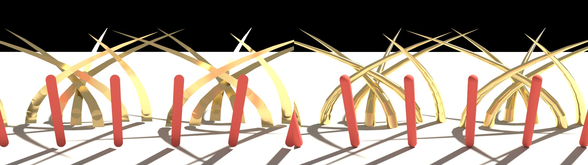
- **Hair**: on curves, `HairMaterial_v3` is a hair fibre with MoonRay's four lobes (light
  reflected off the fibre, passed through it, reflected once inside it, and the rest), by the
  formulas of MoonRay's own hair code and its rules for each lobe's roughness and offset. Hair
  colour can be textured. Glints (with each strand's own twist), the saturation of direct
  transmission and the layered cuticle Fresnel are drawn too: 76%, 77% and 78% of tiles within
  a tenth. `HairDiffuseMaterial` is its colour on a matte strand. Measured on
  a head of 2,500 strands: brightness 1.02 of MoonRay's, 77% (dark) and 80% (fair) of tiles
  within a tenth.
  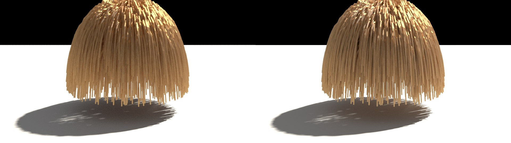
- **Skin**: `DwaSkinMaterial` is read as itself: albedo, scattering beneath the surface,
  moisture as a clear coat, and diffuse light passing through to the far side (diffuse
  transmission, on every Dwa surface material). Brightness 0.98, 98% of tiles within a tenth;
  with light passing through, 1.03 and 99%. Light beneath the surface is still looked for down
  the normal only: probing across the surface as well, which would light thin ears from behind
  by scattering, was tried and measured darker than MoonRay, and was left out.
- **Volumes**: a `BaseVolume` with constant values, on a MoonRay box or sphere shape that has
  no material, is an even fog: it dims and tints what is behind it, scatters the lights' light
  once (MoonRay's default) with its anisotropy, glows with its emission, and thins shadows.
  Brightness 1.03 to 1.04, 80 to 89% of tiles within a tenth. Not drawn: VDB volumes, volumes
  with ramps, a volume inside a shape that also has a surface material, and fog seen from a
  camera inside it.
  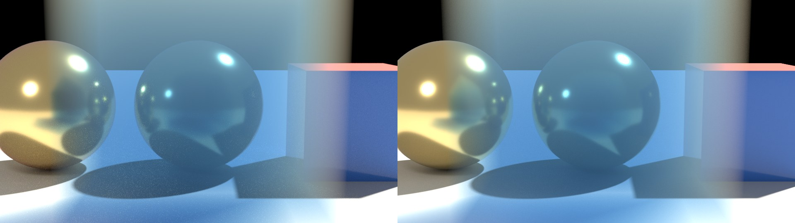
- **Pictures on lights**: sphere, disk, spot, cylinder and distant lights show their texture as
  rect lights did, each laid out as MoonRay lays it (91 to 95% of tiles within a tenth). A
  distant light with `normalized` off is as bright as MoonRay makes it (98%). Rect, disk,
  cylinder and distant lights are sampled where their picture is bright, which takes the noise
  out of a mostly dark picture; sphere and spot lights are sampled evenly.
  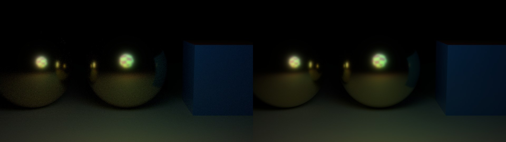
- **Imported MaterialX graphs**: UVs that nodes move, turn or scale, and arithmetic between
  images (one blended into another through a third, an image brought into a range, masks
  taken away), as a layer stack at the images' own sharpness.
- **The specular amount** of Modo's standard material and the Principled material's metallic
  and F0, as a weight on the specular lobe, as the plugin now sends them to MoonRay.
- **The sun of a physical sky**: the camera, and mirrors, see a disc of Modo's width in the colour
  Modo's own renderer gives it, which Disc In-Scatter changes; the disc lights nothing, and the sun
  light goes on lighting the scene as before. The colour is read from a table measured in Modo
  over sun height, haze and five amounts of in-scatter (`tools/probe_modo_disc.py`,
  `tools/build_modo_disc.py`); with Clamp Sky Brightness the disc's strongest part is 1. MoonRay
  is given the same disc as a second distant light.
  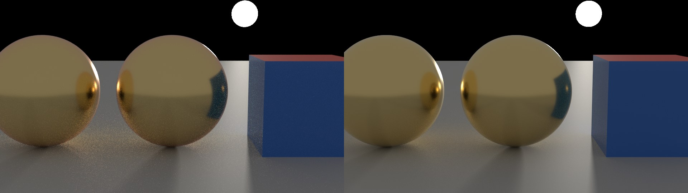
- **Lights that are not normalized**, as described above.

## Build

MoonLightIPR uses the pinned CUDA 12.8 and OptiX 7.6 components that `tools/setup_xpu.py`
fetches for the XPU renderer, and the project's MinGW toolchain. NVRTC compiles the
device program, so no host CUDA compiler is needed. An NVIDIA RTX GPU is required.

    python tools/build_moonlightipr.py --probe --session

This configures `build/moonlightipr` and builds `moonlightipr_probe.exe`,
`moonlightipr_session.exe` and `shaders/MoonLightIPRKernel.ptx`. `--probe` runs the
standalone probe. `--session` runs `tools/check_moonlightipr_session.py`, which packs a
snapshot, drives the session as the plugin will, and checks progressive frames,
edits, a rejected scene and shutdown. Images and logs go to `build/moonlightipr`.

`python tools/stage_moonlightipr.py` copies the session, its device program and the
CUDA runtime DLL into one folder (`build/moonlightipr/stage` by default), which is the
layout `moonlightipr_session.supported()` expects. The session links statically and
needs no MinGW DLLs. `tools/check_moonlightipr_qt_session.py` then exercises the Qt
class; it needs a Python with PySide2, such as Modo's bundled interpreter.

## Local check, October 6, 2026

The probe passed on the RTX 3090 at 960 x 540 with a 196,610-triangle instanced scene:
about 1.0 ms per sample, 7 ms to denoise and read back, and about 1 ms from a
material, transform or camera edit to the next sample. The one-time pipeline setup
took 1.8 s. The images showed correct shadows, reflections and denoising by eye.
This is one small scene; it is not a benchmark and says nothing yet about real Modo
scenes or about agreement with MoonRay.

The session check passed with a hand-built snapshot (a ground plane, an instanced
ball and a faceted cube with per-polygon materials, a sun and a gradient sky) at
960 x 540. A camera, material or transform edit packed in under 1 ms, sent about
1.3 KB instead of the 169 KB full scene, and showed its first denoised frame 20 to
50 ms later; 256 samples took about 0.47 s. A 262,000-triangle mesh packed in 0.4 s,
once. The frames looked right by eye. The Qt class passed under Modo 16.1v9's
Python 3.9 and PySide2, outside Modo: of five edits submitted in a burst, only the
first and the last were applied and only the last was rendered to completion.

`tools/check_moonlightipr_renderer.py` passed under the same interpreter with the
`xpu-paths-0349-candidate` runtime supplying display conversion: two previews
through the plugin's `Renderer` completed on one session, 10 of 14 frames were
displayed (the rest arrived while a conversion was running), the finished frame was
always shown, and an unsupported light reached the notices.

That was the state on October 6. Since then MoonLightIPR has been used inside Modo on real
scenes, the comparisons with MoonRay above were made, and isolated-Modo tests drive the
panel with it (`tools/probe_curves_preview.py`, `tools/probe_materialx.py`, `tools/probe_hair.py`).

## Update latency

What happens between an edit and the next frame, measured outside Modo on a
200,000-quad mesh:

| Step | Before | Now |
|---|---|---|
| Panel change detection (`_digest`, twice per update) | 12.4 s each | 0.1 ms; 0.34 s the first time a mesh is seen |
| Pack after a camera, material or transform edit | 0.7 ms | about 1 ms |
| Pack after a full recapture of unchanged geometry | 2.0 s | 0.07 s |
| First pack of the mesh | 2.0 s | 1.3 s |

The panel used to stream the whole snapshot, every vertex included, through
Python's JSON encoder to decide whether anything changed. `scene_digest.py` hashes
each geometry list once and remembers it by identity; this serves MoonRay previews
too. The packer keys triangulations by the same content hashes, so a recapture into
new lists reuses them. Stop now pauses the session and keeps its meshes loaded;
only switching the preview engine to MoonRay, or closing the panel, ends it.

Capturing the scene from Modo happens before any of this. As of 0.3.50.1 a mesh of 5,000
polygons or more is read from Modo in one call by the plugin's native adapter: a
139,000-polygon test went from 4.8 s to 1.4 s. A scene with an imported MaterialX material
used to stall this step for minutes, which is fixed; the whole scene is also no longer read
again every 15 seconds while IPR runs unless that is asked for in the preferences.

With MoonLightIPR selected the panel looks for changes every 60 ms and no longer waits
for the mouse button to come up when Modo reports a light, transform or material
edit during a drag. In practice that seldom helps. A trace taken inside Modo showed
that viewport navigation sends no notification until release, and that neither the
camera's channels nor the viewport's eye position change before then, so a camera
move still appears on release. The transform tool does notify during a drag (some
2,400 times in one test), but in that scene the edit was classified as needing a
recapture, which waits for release. Why it was classified so was not established.

## Known gaps in the hookup

- The preview buffer menu has no effect; MoonLightIPR produces beauty only. Choosing a
  Cryptomatte buffer says that it needs the MoonRay engine.
- With the ACES or an OCIO view transform the picture goes through a slower display path
  than plain sRGB; its cost during fast IPR updates has not been measured.
- Viewport navigation reaches MoonLightIPR only when the mouse button comes up, because Modo
  reports it only then.

## Not done yet

- VDB volumes, volumes with ramps, and fog seen from inside it.
- Subsurface light found across the surface as well as down its normal.
- The layer features listed above as reported; rod, barn door, cookie, VDB and combined
  light filters.
- Motion blur during IPR updates, moving lights, and a comparison of motion blur with MoonRay.
- A test of OCIO colour spaces, and of UDIM against a MoonRay that loads the tiles.
- Comparison against MoonRay on scenes captured from Modo. The comparisons above use
  scenes built by `tools/compare_moonlightipr.py`.
